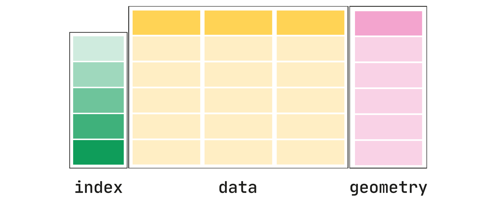
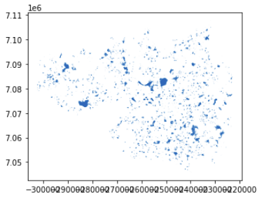

The benefits of having public green areas around when living in a densily populated city are many, from encouraging exercise or providing spaces for socializing to decreasing noise and air pollution.

I aim to map public green areas in Manchester and how they distribute according to it population. Fields in Trust have done an amazing job at mapping the whole of the UK and stablishing their [green-space-index](https://www.fieldsintrust.org/green-space-index), but I aim to have my own go at running an spatial analysis using python and geopandas.

### GIS and spatial analysis
GIS stands for Geographic Information System and it is a spatial system that enables the creation, management, analysis and mapping of all types of data. GIS allows to understand information within their geographic context, being able to spot geographical patterns, which would be very defficult to spot without the aid of a map. This type of analysis is called spatial analysis, and it is commonly used across many industries to discover patterns, incidents and coordinate spatial resources.

There are a few main concepts that is perhaps best to tackle first:

<center>
    <figure>
        
        <figcaption><i>Difference between GCS and PCS.</i></figcaption>
    </figure>
</center>

* A **geographic coordinate system** (GCS) is a reference framework that defines the locations of features on a model of the earth. It’s shaped like a globe—spherical. Its units are angular, usually degrees.

* A **projected coordinate system** (PCS) is flat. It contains a GCS, but it converts that GCS into a flat surface, by projecting points into the plane. Its units are linear, for example in meters. Note that not all projections conserve area, therefore two shapes with same area on the globe may appear to be different in size after having been projected.

### Where to find geo open data
For any piece of spatial analysis the first thing you need is geographic data, ideally open source (unless your company is paying for it!). Geospatial data can come in many shapes (pun intended) and forms. Geospatial data files contain geometric location and any other associated attribute information. There are many different formats, but most common ones are: 

* Esri **Shapefile** - the industry standard. A complete set of three files make up a shapefile: .shp is the feature geometry, .shx is the shape index positiona and .dbf is the attribute data.
* Geographic JavaScript Object Notation (**GeoJSON**) - commonly used for web-based mapping. GeoJSON stores coordinates in JSON format. Extensions are .geojson and .json.
  
Other resources may just provide a raw flat csv file with a reference to a geographical area, like a postcode. A combination of that flat file and a shape file may be needed in these cases.

Government institutions usually collate and share geographical information at different granularities. In the UK, the [Office for National Statistics](https://geoportal.statistics.gov.uk/) and [OrdenanceSurvey](https://www.ordnancesurvey.co.uk/business-government/tools-support/open-data-support) are your two main go-to places. In Manchester, [Mapping GM](https://mappinggm.org.uk/metadata/) is a great resource that collates geo spatial data from different sources. But remember, Google is always your friend.

For this analysis, we have downloaded data from:
* [Ordenance Survey's green space vector data](https://www.ordnancesurvey.co.uk/business-government/products/open-map-greenspace)
* [Ordenance Survey's boundaries](https://osdatahub.os.uk/downloads/open/BoundaryLine)
* [Postal Sector shapes from Edinburgh Data Share](https://datashare.ed.ac.uk/handle/10283/2597)
* [Population data at postal sector level can be extracted from Nomis](https://www.nomisweb.co.uk/census/2011/ks101ew)


### Geopandas for data manipulation
GeoPandas is a python library that enables geospatial data manipulation. It introduces the `geoSeries`, a subclass of `pandas.Series`, handles the geometries  (points, polygons etc.). The `geoDataFrame` extends the popular concept of a `pandas.DataFrame` by adding a `geometry` column, which specifies the geometry of each row in a `geoSeries`. The beauty of this class hierarchy is that you can store as much metadata in your `geoDataFrame` as you would in aregular `DataFrame` and you can keep using Pandas functionalities for data manipulation for free. 

<center>
    <figure>
        
        <figcaption><i>GeoDataFrame diagram.</i></figcaption>
    </figure>
</center>

`geoSeries` make use of [shapely geometry objects](https://shapely.readthedocs.io/en/stable/manual.html#geometric-objects) to specify their spatial boundaries. 

<center>
    <figure>
        
        
        <figcaption><i>Shapely line and polygon.</i></figcaption>
    </figure>
</center>

There are three main types: 

* A **point**, coordinate values or point tuple parameters. `Point(0.0, 0.0)`
* A **line**, an ordered sequence of 2 or more point tuples. `LineString([(0, 0), (1, 1)])`
* A **polygon**, an ordered sequence of point tuples that form a closed polygon. It can also specify an optional unordered sequence of ring-like sequences specifying the interior boundaries or “holes” of the feature. `Polygon([(0, 0), (1, 1), (1, 0)])`

`geoSeries` also store information about the projection used to generate the coordinates (`geoSeries.crs`). A single `geoDataFrame` can contain  multiple `geoSeries` with different CRS, which means you can store multiple projections of the same geospatial objects, although only one geomtry will be considered as the *active* geometry for a specific `geoDataFrame`. 


But, how does one use GeoPandas then? Well, I am glad you asked.

To start with, you need to read the geospatial file using `geoPandas.read_file()`, which automatically detects the filetype and returns a `geoDataFrame` object. 

```python
import geopandas as gpd

fp = 'data/boundary_lines/district_borough_unitary_region.shp'
df = gpd.read_file(fp)
```

GeoPandas reading functionality is powered by the great `fiona` library, which in turn makes use of a massive open-source program called GDAL/OGR designed to facilitate spatial data transformations.

<center>
    <figure>
        
        <figcaption><i>GeoDataFrame sneak-peek.</i></figcaption>
    </figure>
</center>

As our boundaries file contains boundary polygons for all districts in the UK, we need to filter down to only those of Greater Manchester. We can use regular Pandas functionality to do this:

```python
greater_manchester_districts = [
    'Manchester District (B)',
    'Bury District (B)',
    'Oldham District (B)',
    'Rochdale District (B)',
    'Salford District (B)',
    'Trafford District (B)',
    'Stockport District (B)',
    'Tameside District (B)',
    'Bolton District (B)',
    'Wigan District (B)',
]

# Filtering to Greater Manchester
gmcr_boroughs = df[df['NAME'].isin(greater_manchester_districts)]
```

And lastly, for particular tasks you may need to change the projection that your data comes in. For example, we need to use `epsg=3857` (WGS 84 / Pseudo-Mercator) to be abel to plot on top of `contextly` open maps. Luckily, changing the projection used is really easy with the `geoDataFrame.to_crs()` method.

```python
gmcr_boroughs.to_crs(epsg=3857, inplace=True)
```

### Green public areas in Greater Manchester
So far so good, but we need to upload geospatial data for green public areas within Greater Manchester. In our case, we know that Grater Manchester spreads across OrdenanceSurvey *SD* and *SJ* quadrants, so we need to read both files and concatenate the resulting geoDataFrames.

```python
fp = 'data/greenspace_SD/SD_GreenspaceSite.shp'
gs_sd = gpd.read_file(fp)

fp = 'data/greenspace_SJ/SJ_GreenspaceSite.shp'
gs_sj = gpd.read_file(fp)

gs = gpd.GeoDataFrame(
    pd.concat([gs_sd, gs_sj], ignore_index=True)
)
```

We are only interested in certain types of green spaces, so we will filter down our geoDataFrame. 

```python
function_types = [
    'Play Space',
    'Playing Field',
    'Public Park Or Garden',
    'Bowling Green',
    'Allotments Or Community Growing Spaces',
]
gs = gs[gs['function'].isin(function_types)]
```

Still, `gs` will contain all polygons for quadrants *SD* and *SJ*. We can use `geoPandas.overlay()` function to intersect `gs` and `gmcr_boroughs` frames.

```python3
# Filtering down to green spaces in greater manchester
gmcr_gs = gpd.overlay(gmcr_boroughs, gs, how='intersection')
```

### Mapping with matplotlib
Now we can finally plot these green spaces. `GeoPandas` can also plot maps with the aid of the `geoDataFrame.plot()` method which calls the `matplotlib` library.

```python
gmcr_gs.plot()
```

<center>
    <figure>
        
        <figcaption><i>Output of `gmcr_gs.plot()`.</i></figcaption>
    </figure>
</center>

The first time I manage to plot a geospatial data, I was really excited. But quickly you realise that as maps go, this simple rendering of our `geoDataFrame` lacks the feel of a map. Let's work on that.

Let's start by defining the bounding box for the map. We can use `shapely.ops.cascade_union` function to union polygons that define Greater Manchester into one big polygon. Then we can use the `geoSeries.bounds` property to extract the minimum and maximum coordinates for the polygon.

```python
from shapely.ops import cascaded_union

# Define Greater Manchester polygon
greater_manchester = gpd.GeoSeries(cascaded_union(gmcr_boroughs.geometry))

# Define bounding box
bounds = greater_manchester.bounds
bounding_box = [
    bounds['minx'][0],
    bounds['maxx'][0],
    bounds['miny'][0],
    bounds['maxy'][0],
]

# Set bounds
ax.set_xlim(bounding_box[0]-1000, bounding_box[1] + 1000)
ax.set_ylim(bounding_box[2]-1000, bounding_box[3] + 1000)
```

We then can go on and plot both the local authority boundaries (almost transparent, with `alpha=0.3`) and the green area polygons (as green shapes).

```python
# Plot borough borders
gmcr_boroughs.plot(
    ax=ax, 
    alpha=0.3, 
    edgecolor='black', 
    facecolor='silver',
)

# Plot green areas
gmcr_gs.plot(
    ax=ax, 
    alpha = 0.9, 
    color='mediumseagreen',
    label='Green Open Spaces',
)
```

We can use `contextily` to add a backgrund map, which enhances the geographic contextualisation.

```python
import contextily as cx # map backgrounds

# Add background
cx.add_basemap(ax, source=cx.providers.Stamen.TonerLite)
```

Let's also remove ticks from axes, as they no longer carry relevant meaning.

```python
# Remove axis 
ax.set_yticklabels([])
ax.set_xticklabels([])
```

Last but not least, I want to add a legend. As the map layers we have added don't provide legend handles, we will create them from scratch with the following few lines.

```python
# Legend
import matplotlib.patches as mpatches
green_patch = mpatches.Patch(color='mediumseagreen', alpha=0.9, label='Green public spaces')
gray_patch = mpatches.Patch(facecolor='silver', edgecolor='black', alpha=0.3, label='Local Authorities')
leg = plt.legend(
    handles=[green_patch, gray_patch],
    bbox_to_anchor=(1.05, 1),
    loc=2,
    borderaxespad=0.,
    frameon=False,
    prop={'size': 12},
```

Putting it all together, we get this beauty of a map.

<center>
    <figure>
        
    </figure>
</center>

### Running spatial calculations
Fantastic. But, what if we want to run more complex calculations. For example, what if we want to quantify the access to green public space based on population and break this down to a granular geographic breakdown, like postal sector?

### To wrap-up
tbd
