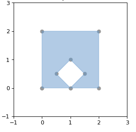

The benefits of having public green areas around when living in a densily populated city are many, from encouraging exercise or providing spaces for socializing to decreasing noise and air pollution.

I aim to map public green areas in Manchester and how they distribute according to it population. Fields in Trust have done an amazing job at mapping the whole of the UK and stablishing their [green-space-index](https://www.fieldsintrust.org/green-space-index), but I aim to have my own go at running an spatial analysis using python and geopandas.

### GIS and spatial analysis
GIS stands for Geographic Information System and it is a spatial system that enables the creation, management, analysis and mapping of all types of data. GIS allows to understand information within their geographic context, being able to spot geographical patterns, which would be very defficult to spot without the aid of a map. This type of analysis is called spatial analysis, and it is commonly used across many industries to discover patterns, incidents and coordinate spatial resources.

There are a few main concepts that is perhaps best to tackle first:

<center>
    <figure>
        
        <figcaption><i>Difference between GCS and PCS.</i></figcaption>
    </figure>
</center>

* A **geographic coordinate system** (GCS) is a reference framework that defines the locations of features on a model of the earth. It’s shaped like a globe—spherical. Its units are angular, usually degrees.

* A **projected coordinate system** (PCS) is flat. It contains a GCS, but it converts that GCS into a flat surface, by projecting points into the plane. Its units are linear, for example in meters. Note that not all projections conserve area, therefore two shapes with same area.

### Where to find geo open data
For any piece of spatial analysis the first thing you need is geographic data, ideally open source (unless your company is paying for it!). Geospatial data can come in many shapes (pun intended) and forms. Geospatial data files contain geometric location and any other associated attribute information. There are many different formats, but most common ones are: 

* Esri **Shapefile** - the industry standard. A complete set of three files make up a shapefile: .shp is the feature geometry, .shx is the shape index positiona and .dbf is the attribute data.
* Geographic JavaScript Object Notation (**GeoJSON**) - commonly used for web-based mapping. GeoJSON stores coordinates in JSON format. Extensions are .geojson and .json.
  
Other resources may just provide a raw flat csv file with a reference to a geographical area, like a postcode. A combination of that flat file and a shape file may be needed in these cases.

Government institutions usually collate and share geographical information at different granularities. In the UK, the [Office for National Statistics](https://geoportal.statistics.gov.uk/) and [OrdenanceSurvey](https://www.ordnancesurvey.co.uk/business-government/tools-support/open-data-support) are your two main go-to places. In Manchester, [Mapping GM](https://mappinggm.org.uk/metadata/) is a great resource that collates geo spatial data from different sources. But remember, Google is always your friend.

For this analysis, we have downloaded data from:
* [Ordenance Survey's green space vector data](https://www.ordnancesurvey.co.uk/business-government/products/open-map-greenspace)
* [Ordenance Survey's boundaries](https://osdatahub.os.uk/downloads/open/BoundaryLine)
* [Postal Sector shapes from Edinburgh Data Share](https://datashare.ed.ac.uk/handle/10283/2597)
* [Population data at postal sector level can be extracted from Nomis](https://www.nomisweb.co.uk/census/2011/ks101ew)


### Geopandas for data manipulation
GeoPandas is a python library that enables geospatial data manipulation. It introduces the `geoSeries`, a subclass of `pandas.Series`, handles the geometries  (points, polygons etc.). The `geoDataFrame` extends the popular concept of a `pandas.DataFrame` by adding a `geometry` column, which specifies the geometry of each row in a `geoSeries`. The beauty of this class hierarchy is that you can store as much metadata in your `geoDataFrame` as you would in aregular `DataFrame` and you can keep using Pandas functionalities for data manipulation for free. 

<center>
    <figure>
        
        <figcaption><i>GeoDataFrame diagram.</i></figcaption>
    </figure>
</center>

`geoSeries` make use of [shapely geometry objects](https://shapely.readthedocs.io/en/stable/manual.html#geometric-objects) to specify their spatial boundaries. 

<center>
    <figure>
        
        
        <figcaption><i>Shapely line and polygon.</i></figcaption>
    </figure>
</center>

There are three main types: 

* A point, coordinate values or point tuple parameters. `Point(0.0, 0.0)`
* A line, an ordered sequence of 2 or more point tuples. `LineString([(0, 0), (1, 1)])`
* A polygon, an ordered sequence of point tuples that form a close polygon. It can also specify an optional unordered sequence of ring-like sequences specifying the interior boundaries or “holes” of the feature. `Polygon([(0, 0), (1, 1), (1, 0)])`

Each GeoSeries can contain any geometry type (you can even mix them within a single array) and has a GeoSeries.crs attribute, which stores information about the projection (CRS stands for Coordinate Reference System). Therefore, each GeoSeries in a GeoDataFrame can be in a different projection, allowing you to have, for example, multiple versions (different projections) of the same geometry.

Only one GeoSeries in a GeoDataFrame is considered the active geometry, which means that all geometric operations applied to a GeoDataFrame operate on this active column.

```python
fp = 'data/boundary_lines/district_borough_unitary_region.shp'
df = gpd.read_file(fp)
```

### Mapping with matplotlib
tbc

### Running spatial calculations
tbc

### To wrap-up
tbd
