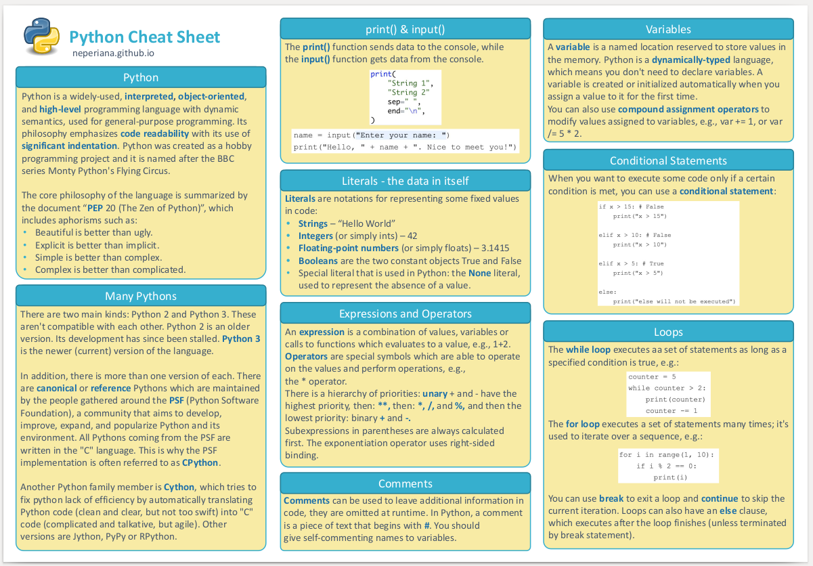

Python is a trully versatile programming language and the more Python I learn the harder it gets to remember everything. Because of this, I have started compiling my own Python cheat sheet to cover all those bits of knowledge that are useful but that if not used regularly one tends to forget. The term *sheet* is perhaps not the best, it is perhaps closer to a cheat *notebook*. 

    <figure>
        
        <figcaption><a href='../media/Python.pdf'><i>Download HERE</i></a></figcaption>
    </figure>

